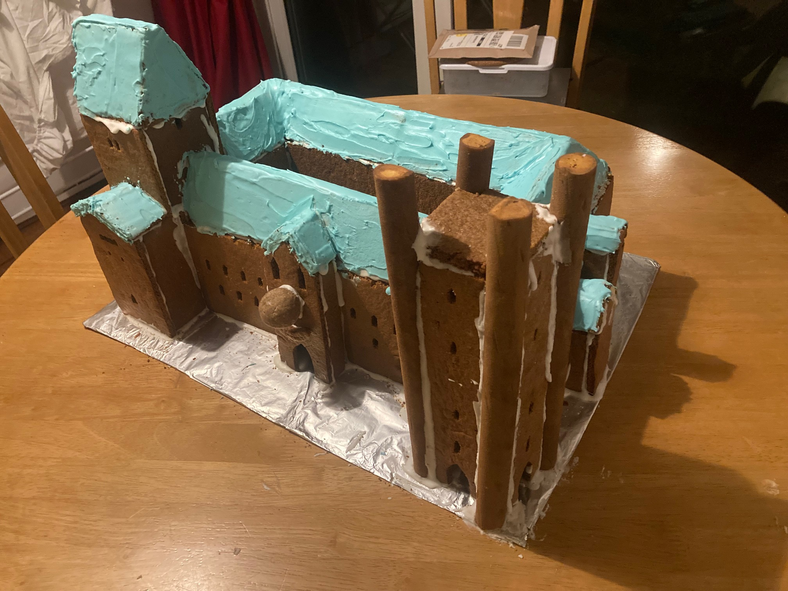

---

layout: single
type: pages
title: Gallery
permalink: /pages/gallery/
author_profile: true

---

## Gingerbread Houses

A collection of Discworld-inspired gingerbread houses.

#### [Granny Weatherwax's cottage](https://www.discworldemporium.com/blog/illustrating-granny-weatherwax-s-cottage-n11)

#### [The Fool's Guild](https://wiki.lspace.org/Fools%27_Guild)

## Art

#### Music
|  |

|:--:|

| <b> Wooden cello clef </b>|

|:--:|

| <b> Wooden bass clef </b>|

|:--:|

| <b> Wooden alto clef </b>|

|:--:|

| <b> Natural gramophone </b>|

#### Discworld

|:--:|

| <b> The Great A'Tuin </b>|

#### Nature

Art that was created at various natural history museums. 

|:--:|

| <b> A rose </b>|

|:--:|

| <b> A squirrel </b>|

|:--:|

| <b> A seahorse </b>|

|:--:|

| <b> A baby albatross </b>|

