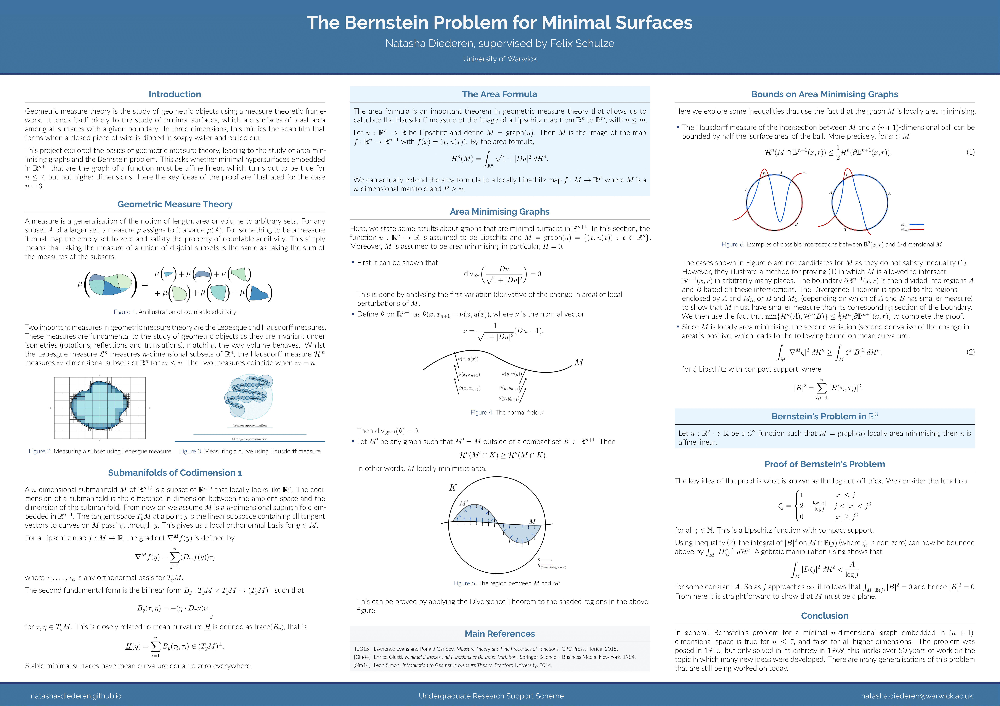
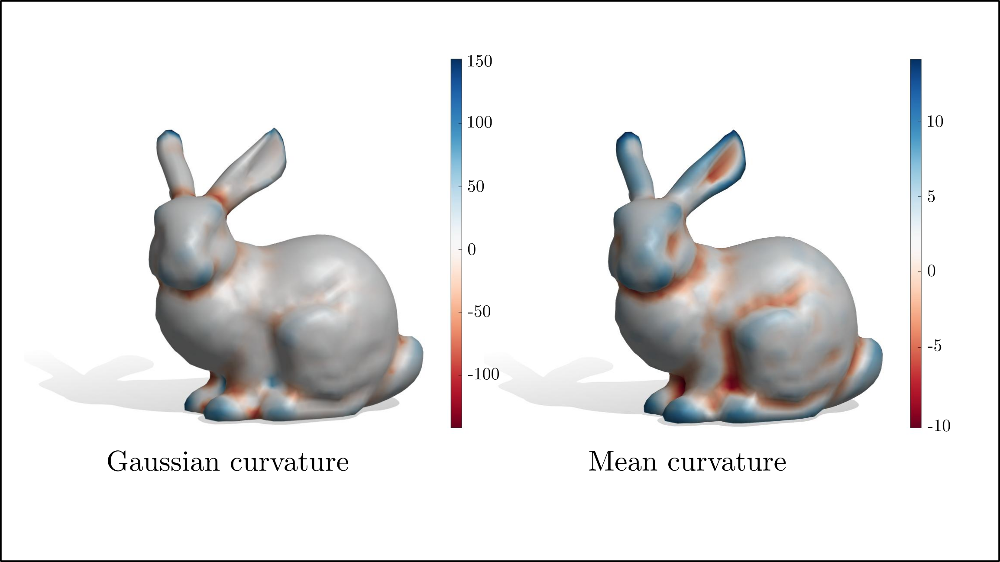
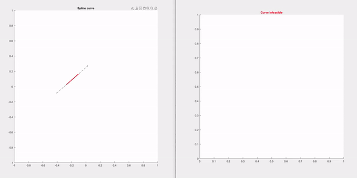
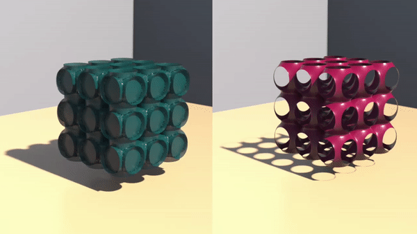

---

layout: single
type: pages
title: Projects
permalink: /pages/projects/
author_profile: true

---
## Undergraduate Research Support Scheme
Funded research project supervised by Professor Felix Schulze on Berstein's Problem for minimal surfaces. 

*[Write-up](../assets/images/urss.pdf)*

## Second year essay
A 15 page essay written as part of my degree on curvature estimation on triangle meshes using a generalisation of 
the second fundamental form.

*[Essay](../assets/images/essay.pdf)*

## Summer Geometry Institute 2021
Projects undertaken as a part of the 2021 Summer Geometry Institute, hosted remotely by MIT.

*[Incompressible flow on meshes](http://summergeometry.org/sgi2021/incompressible-flows-on-meshes/)*

*[Elastic curves and active bending](http://summergeometry.org/sgi2021/elastic-curves-and-active-bending/)*

*[Triply periodic non-manifold minimal surfaces](http://summergeometry.org/sgi2021/minimal-surfaces-but-with-saddle-points/)*

